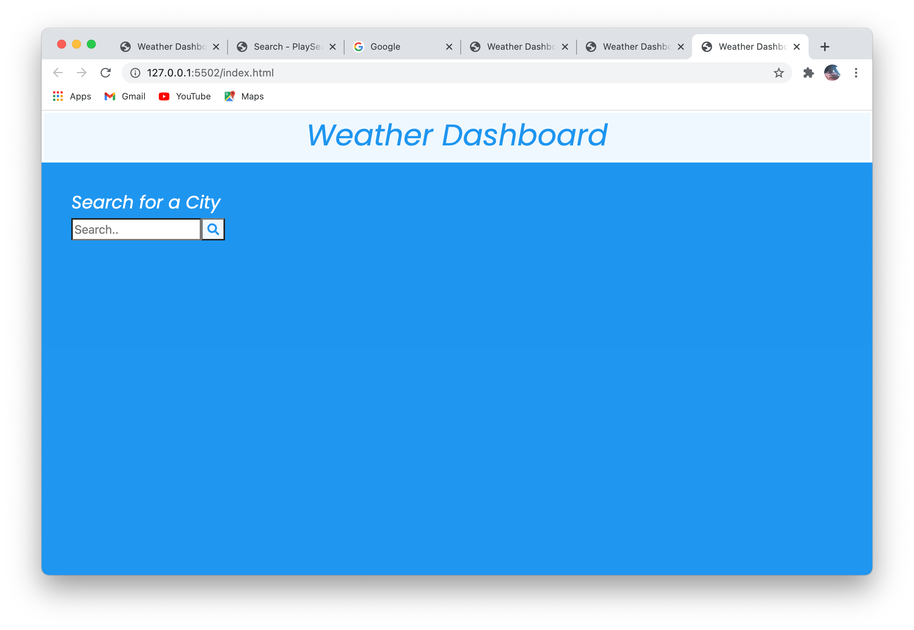
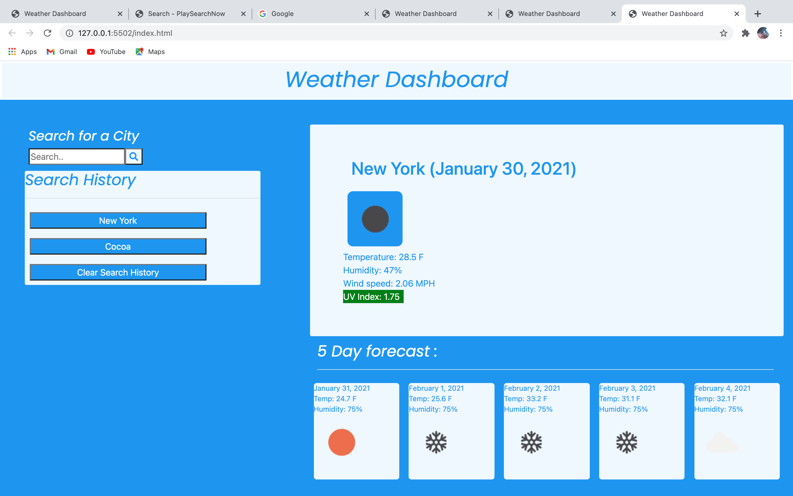

# Project Title 

Weather Dashboard 

# Description

This application is a dashborad in which you can check the weather of any city. When you enter a city in the search bar and click the search button, the current weather temperature, humidity percentage, wind speed, and UV index for that city is displayed. The temperature and humidity percentage for the next 5 days are also displayed. Each city that is searched is stored in a search history section of the webpage and can be clicked for weather info display.

## Table of Content

1. [Installation requirements](#Installation)
2. [Deployed App](#Deployed)
3. [Contributions](#contributions)
4. [screenshots](#Screenshots)
5. [Questions](#questions)

## Installation

HTML, CSS, JavaScript, JQuery

## Deployed

https://dariushay.github.io/weather-dashboard/

## Contributions

Darius Hay https://github.com/DariusHay

## Screenshots

;
;

## Questions

If you have any additional questions about this project, you can find me on GitHub at DariusHay https://github.com/DariusHay, or you can email me at dariushay@gmail.com, thank you.

